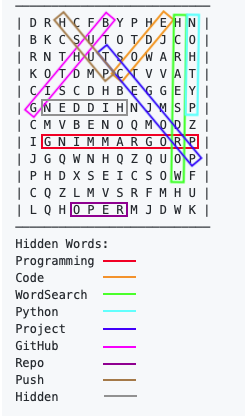

# Word Search
Python script allows users to enter words that they want hidden amongst a bunch of random letters in an array.

### Example Run
```
Enter words to include in word search (enter blank line when finished): 
Programming
Code
WordSearch
Python
Project
GitHub
Repo
Push
Hidden

Recommended size: 11 X 11
Enter dimensions:
Rows = 12
Columns = 12

–––––––––––––––––––––––––––
| D R H C F B Y P H E H N |
| B K C S U T O T D J C O |
| R N T H U T S O W A R H |
| K O T D M P C T V V A T |
| C I S C D H B E G G E Y |
| G N E D D I H N J M S P |
| C M V B E N O Q M O D Z |
| I G N I M M A R G O R P |
| J G Q W N H Q Z Q U O P |
| P H D X S E I C S O W F |
| C Q Z L M V S R F M H U |
| L Q H O P E R M J D W K |
–––––––––––––––––––––––––––
Hidden Words:
Programming
Code
WordSearch
Python
Project
GitHub
Repo
Push
Hidden
```

### Solution

